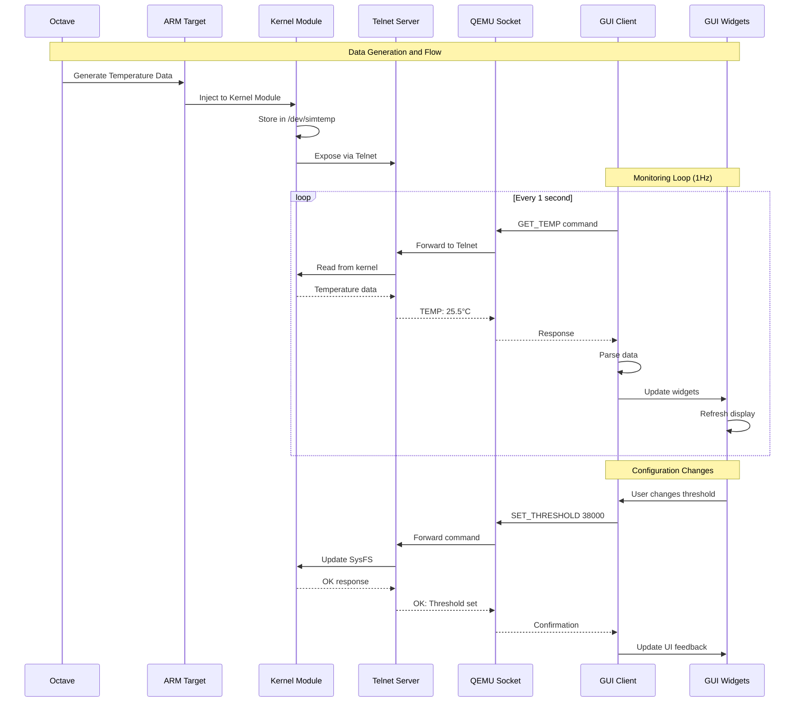
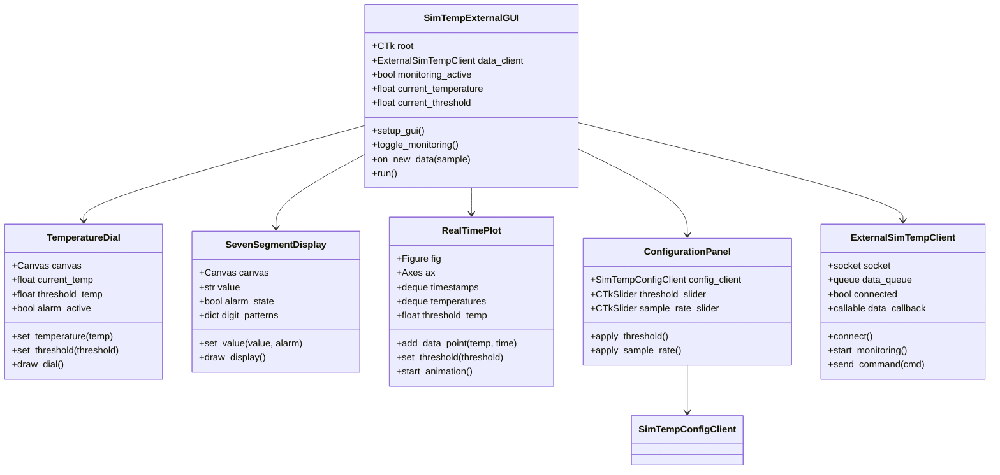
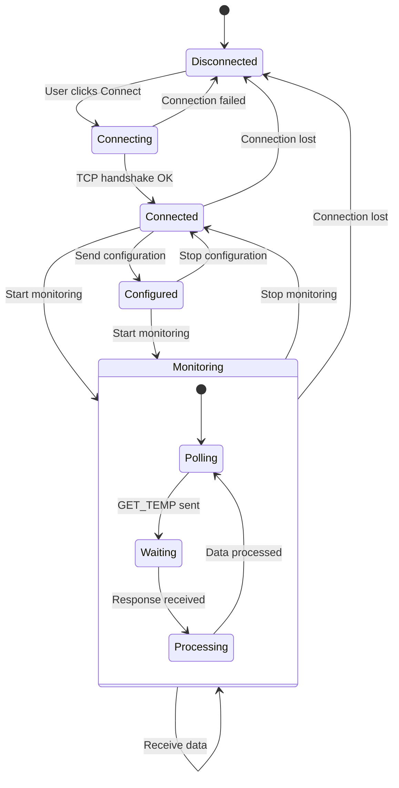
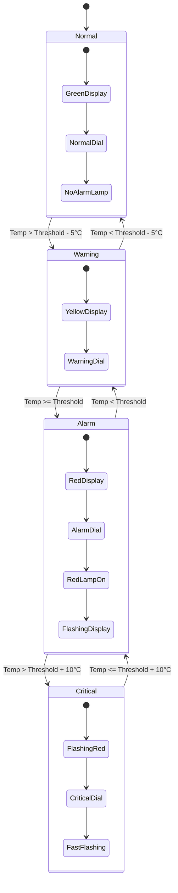
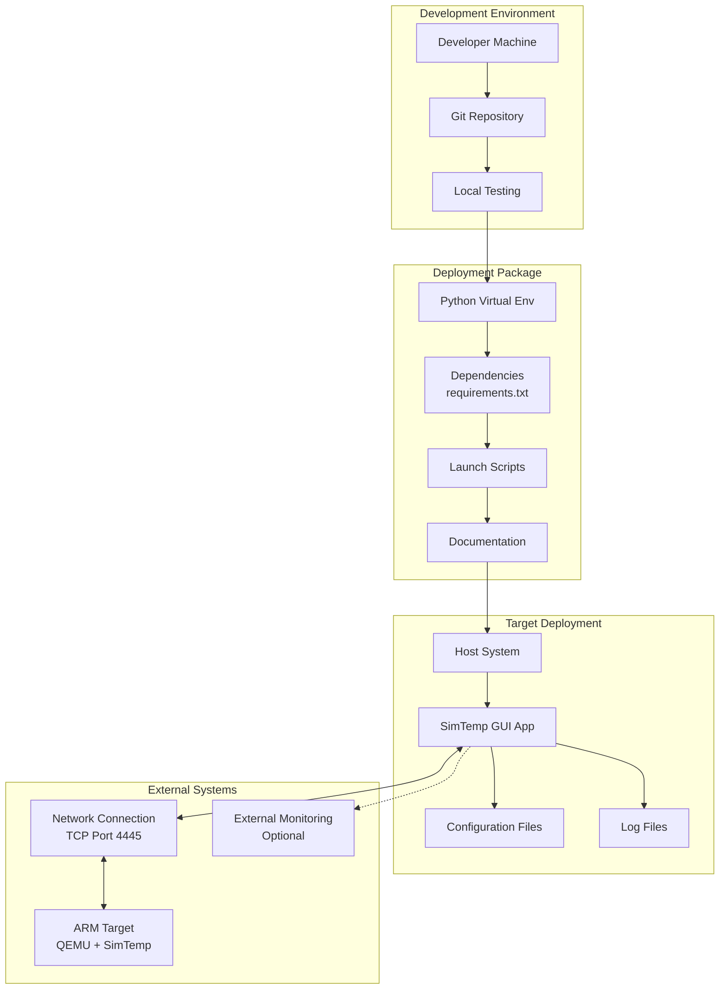
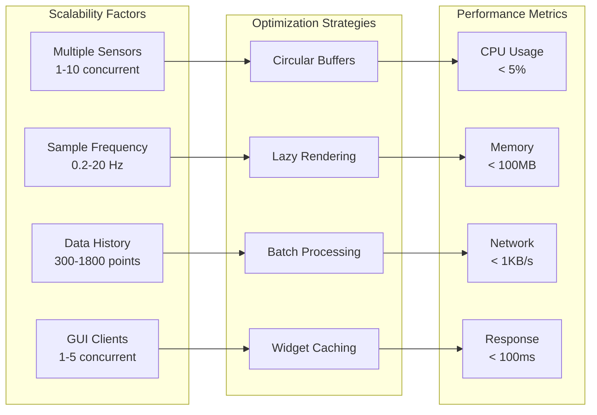

# SimTemp External GUI - Visual Diagrams

This file contains Mermaid format diagrams to visualize the system architecture.

## General System Architecture

```mermaid
graph TB
    subgraph "HOST SYSTEM (External)"
        subgraph "SimTemp External GUI"
            GUI[CustomTkinter Application]
            subgraph "Visual Components"
                DIAL[Temperature Dial]
                DISPLAY[7-Segment Display]
                PLOT[Real-time Plot]
                CONFIG[Configuration Panel]
            end
            subgraph "Data Management"
                CLIENT[ExternalSimTempClient]
                QUEUE[Queue Threading]
                CONFIGCLIENT[SimTempConfigClient]
            end
        end
    end
    
    subgraph "NETWORK"
        TCP[TCP/Socket<br/>Port 4445]
    end
    
    subgraph "TARGET SYSTEM (ARM)"
        subgraph "QEMU Environment"
            subgraph "ARM Linux System"
                KERNEL[SimTemp Kernel Module<br/>nxp_simtemp.ko]
                DEVICE[/dev/simtemp<br/>Character Device]
                SYSFS[SysFS Interface<br/>/sys/class/misc/simtemp]
                TELNET[Telnet Server<br/>CLI Access]
            end
            subgraph "QEMU Bridge"
                SOCKET[Socket Bridge<br/>Host:4445 ↔ Guest:23]
            end
        end
    end
    
    GUI --> CLIENT
    CLIENT --> TCP
    TCP --> SOCKET
    SOCKET --> TELNET
    TELNET --> KERNEL
    KERNEL --> DEVICE
    KERNEL --> SYSFS
    
    CONFIG --> CONFIGCLIENT
    CONFIGCLIENT --> TCP
    
    CLIENT --> QUEUE
    QUEUE --> DIAL
    QUEUE --> DISPLAY
    QUEUE --> PLOT
```

## Real-time Data Flow



## Threading Architecture

```mermaid
graph LR
    subgraph "Main GUI Thread"
        MAIN[Main Event Loop]
        WIDGETS[Widget Updates]
        EVENTS[User Events]
    end
    
    subgraph "Data Thread"
        POLL[TCP Polling Loop]
        PARSE[Data Parsing]
        CALLBACK[Data Callback]
    end
    
    subgraph "Thread Communication"
        QUEUE[Thread-Safe Queue]
    end
    
    MAIN --> EVENTS
    EVENTS --> MAIN
    
    POLL --> PARSE
    PARSE --> CALLBACK
    CALLBACK --> QUEUE
    
    QUEUE --> WIDGETS
    WIDGETS --> MAIN
    
    MAIN -.->|after(100ms)| WIDGETS
```

## CustomTkinter Component Diagram



## Communication Protocol



## Alarm State Diagram



## Deployment Architecture



## Performance and Scalability

